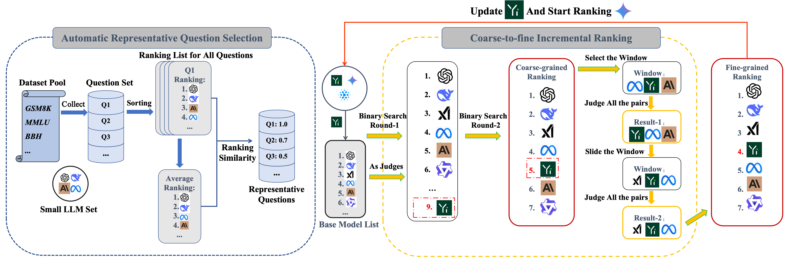

<p align="center">
  <a href="https://de-arena.maitrix.org">Blog</a>
  |
  <a href="https://huggingface.co/spaces/LLM360/de-arena">LeaderBoard</a>
  |
  <a href="https://x.com/MaitrixOrg">Twitter</a>
  |
  <a href="https://discord.gg/b5NEhRbvJg">Discord</a>
  |
  <a href="https://maitrix.org/">@Maitrix.org</a>
  |
  <a href="https://www.llm360.ai">@LLM360</a>
</p>

---

**Decentralized Arena**  is a fully automated framework leveraging collective intelligence from all LLMs to evaluate each other. It provides:

- **coarse-to-fine ranking algorithm**

- **automatic question selection strategy**

## News
- Dec. 31, 2024: We added style control.
- Oct. 10, 2024: We presented our De-Arena [Blog](https://de-arena.maitrix.org) & [LeaderBoard](https://huggingface.co/spaces/LLM360/de-arena), a fully automated framework leveraging collective intelligence from all LLMs to evaluate each other.

## Introduction of the library



In De-Arena, we focus on the idea of decentralization that uses all LLMs as judges to vote on other model pairs, based on high-quality questions each dimension. It can reduce the cost of gathering human annotations, and also avoid the bias that may arise
from relying on a single or a small number of judge models. To achieve it, we devise the coarse-to-fine incremental sort algorithm to efficiently rank a large number of LLMs, and the automatic question selection algorithm to select representative data for building new evaluation dimension.

## Pipeline
### API Example
This example provides the ranking of nine OpenAI API models. The results from the first step have already been stored in **"mt_bench_responses"**, and some results from the second step have also been stored in **"judgements_mt_bench"**. 

- 1. bash response.bash
     
  Parameter List:
  
    - model_name: A list representing the models you want to rank.
    - output_dir: The path where the models' responses are saved.
    - path: The path to the question set.
    - openai_api: Your OpenAI API key.

- 2. bash ranking.bash
     
  Parameter List:
  
    - openai_api: Your OpenAI API key.
    - overall ids: Your question id.
    - save_output_file_path: The path where your judge pairs are saved.
    - judge_open_model: Your open source judge model list.
    - judge_api_model: Your API judge model list.
    - base_model_list: Your base model list.
    - sort_model_list: A list representing the models you want to rank.

### Open Source Example
This example provides the ranking of nine OpenAI API models. The results from the first step have already been stored in **"mt_bench_responses"**, and results from the second step have also been stored in **"judgements_mt_bench"**. 

- 1. bash response.bash
     
  Parameter List:
  
    - model_name: A list representing the models you want to rank.
    - output_dir: The path where the models' responses are saved.
    - path: The path to the question set.
    - openai_api: Your OpenAI API key.

- 2. bash judge.bash

  In this process, to accelerate the evaluation, we first obtain the full sample judge results for each open-source model using this script. The duration of this process depends on the number of GPUs available. However, make sure to modify the **`model_name`** parameter and run this script for all open-source models.

  Parameter List:
  
    - model_name: The model you run the judgements.
    - model_names: A list representing the models you want to rank.
    - path: The path to the question set.
    - q_set: The dimension you are running.

- 3. bash ranking.bash
     
  Parameter List:
  
    - openai_api: Your OpenAI API key. (no need in this example)
    - overall ids: Your question id.
    - save_output_file_path: The path where your judge pairs are saved.
    - judge_open_model: Your open source judge model list.
    - judge_api_model: Your API judge model list.
    - base_model_list: Your base model list.
    - sort_model_list: A list representing the models you want to rank.


## Installation

Make sure to use Python 3.10 or later.

```bash
conda create -n reasoners python=3.10
conda activate reasoners
```

### Install from github

```bash
git clone https://github.com/Yanbin-Yin/De-Arena
cd De-Arena
pip install requirements.txt.
```

## Citation
```bibtex
@misc{decentralized2024,
    title        = {Decentralized Arena via Collective LLM Intelligence: Building Automated, Robust, and Transparent LLM Evaluation for Numerous Dimensions},
    author       = {Yanbin Yin AND Zhen Wang AND Kun Zhou AND Xiangdong Zhang AND Shibo Hao AND Yi Gu AND Jieyuan Liu AND Somanshu Singla AND Tianyang Liu AND Xing, Eric P. AND Zhengzhong Liu AND Haojian Jin AND Zhiting Hu},
    year         = 2024,
    month        = 10,
    url          = {https://de-arena.maitrix.org/}
}
```
